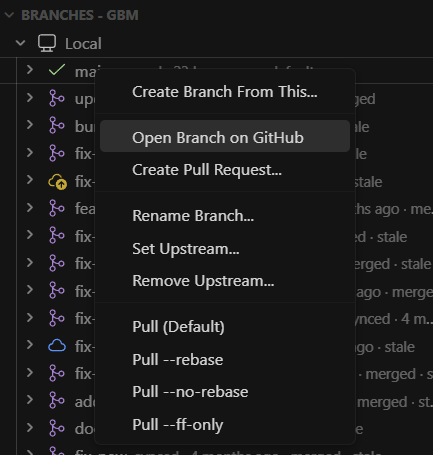
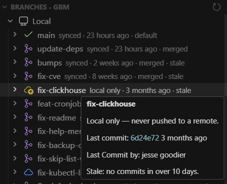

#  Good Branch Manager

A simple branch manager focused on the most common workflows when using git. Lives in the **Source Control** sidebar as a "Branches - GBM" section.

<p>
  
  
</p>

## Installation

Download the latest `.vsix` package from the [GitHub Releases](https://github.com/JesseGoodier/good-branch-manager-extension/releases) page, then install it from VS Code by opening the Extensions view, clicking the three-dot menu, selecting "Install from VSIX...", and choosing the downloaded `.vsix` file.

Or install it from the command line:

```sh
code --install-extension good-branch-manager-<version>.vsix
```

The release workflow packages each version and attaches the VSIX package to the release.

## Features

### Branch list & sync status

- **Branch list** showing local and remote branches sorted by most recent commit, with the current branch highlighted.
- **Local and remote groups**: When showing both scopes, branches are grouped into collapsible Local and Remote sections.
- **Sync indicators**: Colored SVG icons (light/dark variants) show sync state at a glance — checked-out (`synced` / ahead/behind counts), `local only`, `synced`, `upstream gone`, or ahead/behind arrows. Icons keep their color when a row is selected (unlike themed codicons).
- **Stale & merged hints**: Shows last commit age and flags merged or stale branches.
- **Rich tooltips**: Hover a branch for markdown tooltips with linked commit SHAs, upstream refs, PR details, and metadata (author, default branch, stale/merged status).

### Commit history

- **Expandable branches**: Click a branch to expand it and list recent commits. By default, only commits unique to that branch are shown (not commits already on the default branch); enable `showBaseBranchCommits` to include the full history.
- **Show commits in the editor**: Click a commit row to open VS Code's native side-by-side multi-file diff view (the same UI as the built-in Git history). Falls back to an in-extension panel when the Git extension is unavailable.

### GitHub pull requests

- **PR status icons**: When enabled, fetches pull request status from GitHub and shows open, merged, or closed indicators on branch rows.
- **Create Pull Request...**: Opens an in-editor form to create GitHub PRs using VS Code's built-in GitHub auth. Auto-fills title and body from commits, pushes the branch if needed, and offers to open the PR in a browser or check out the base branch afterward.
- **Open Pull Request on GitHub**: Available from the context menu when a branch has an associated PR.
- **Publish-to-PR prompt**: When the checked-out branch is first published to GitHub, asks whether to create a pull request (with "Not Now" and "Don't Ask Again" options).
- **GitHub Enterprise**: Supports GitHub.com, GitHub Enterprise Cloud (`*.github.com`), and GitHub Enterprise Server (`github.*` hosts) for PR creation, status fetching, and opening branches/commits/PRs in the browser.

### Branch actions

Right-click any branch for management actions:

- *Checkout Branch* (remote branches automatically set up tracking)
- *Create Branch From This...*
- *Open Branch on GitHub* (or other supported remote host)
- *Create Pull Request...* (local branches)
- *Open Pull Request on GitHub* (when a PR exists)
- *Rename Branch...*
- *Merge Into Current Branch*
- *Pull (Default)*, *Pull --rebase*, *Pull --no-rebase*, *Pull --ff-only* (current branch with an active upstream only)
- *Set/Remove Upstream...*
- *Delete Branch...* (optionally cleans up the remote counterpart)

### Refresh

- **Prefetch on startup**: Branch data loads proactively when the extension activates, with a loading indicator while the first fetch runs.
- **Automatic & background refresh**: Auto-refreshes on repository changes (commits, checkouts, pushes/fetches) and on a configurable background interval.

## Settings

| Setting | Default | Description |
| ------- | ------- | ----------- |
| `goodBranchManager.branchScope` | `both` | Show `both` local and remote branches, or `local` only |
| `goodBranchManager.staleAfterDays` | `10` | Days without commits before a branch is tagged stale (0 disables) |
| `goodBranchManager.refreshIntervalMins` | `1` | Background refresh interval in minutes (0 disables) |
| `goodBranchManager.defaultBranch` | `""` | Override the detected default branch used for merge/PR defaults |
| `goodBranchManager.showPrStatus` | `true` | Fetch pull request status from GitHub and show open, merged, or closed PR indicators |
| `goodBranchManager.promptForPrOnPublish` | `true` | Ask whether to create a GitHub pull request after publishing the checked-out branch |
| `goodBranchManager.showBaseBranchCommits` | `false` | When expanding a branch, include commits that already exist on its base branch (the default branch). When disabled, only branch-only commits are listed |

